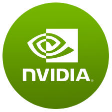

<h2>Hey, I am <a href="https://www.linkedin.com/in/imneonizer/">Nitin Rai</a></h2> 

<h2> I am an AI Application Developer 🚀 </h2>

Education 📚

<ul>
  <li>B.Tech (CSE): <a href=#>William Carey University</a></li>
  <li>Schooling: <a href="#">Ashok Memorial Public School, Faridabad</a></li>
</ul>

Area of Interests 👓 

<ul>
  <li><a>Skills - Machine Learning, Artificial Intelligence, Data Exploration, Data Structures, IoT & Public Speaking </a></li>
  <li><a> Tools - Python, OpenCV, Numpy, Rapids, Flask, JavaScript, Linux-Ubuntu, SSH, Nvidia TLT, Microsoft Office, Docker, Git </a></li>
</ul>

	
Experience  👨‍💻

  <ul>
    <li><a>AI Application Developer, SmartCow</a></li>
    <li><a>Jr. Machine Learning Engineer, SmartCow</a></li>
    <li><a>Computer Vision Intern, Prizmatics</a></li>
     </ul>

  
My Work and Projects 🤖

  <ul>
      <li><b>TLT Lightning</b> - Nvidia Transfer Learning Toolkit based easy to use web application to Train / Infer / Prune / Deploy various SOTA Neural Networks for Deepstream SDK running on Jetson platforms.</li>
	<li><b>Kitti Augmentor</b> - an image augmentation library similar to Nvidia DALI which can augment object detection dataset while transforming both images and bounding boxes at the same time.</li>
	<li><b>Yandex Crawler</b> - an automated image scraper which can scrape millions of similar images quickly.</li>
    <li><b>Frame Buffer</b> - a python library which can store some frames as a buffer on disk / memory and write it as a video when required using multiprocessing, without affecting the main loop.</li>
	<li><b>IMBO</b> - a library to plot pretty bounding boxes with a simple Python API.</li>
	<li><b>Imcrypt</b> - a python library to encrypt any string or file with a private key which can only be decrypted if you have the key.</li>
	<li><b>Link Shrink</b> - Flask backend API with interactive JS based UI to short long URL's on the go.</li>
	<li><b>Imthread</b> - a short little python module to help you run your iterable functions on multiple threads.</li>
	<li><b>Metal stamp OCR</b> - computer vision techniques to extract and recognize characters from metal surfaces. </li>
  </ul>

	
Blogs & Documentations  📝

  <ul>
    <li><a href="https://medium.com/@Smartcow_ai/tlt-lightning-ff47659f7804">TLT Lightning</a></li>
    <li><a href="https://medium.com/@Smartcow_ai/nvidia-transfer-learning-toolkit-a-comprehensive-guide-75148d1ac1b">Nvidia TLT - A Comprehensice Guide</a></li>
    <li><a href="https://medium.com/@mneonizer/day-night-classification-a01a7d9af695">Day - Night Classification</a></li>
    <li><a href="https://mneonizer.gitbook.io/tlt-trainer/">TLT Trainer Docs</a></li>
     </ul>

<h2>Get in touch </h2>

  
Contact: 📞

  <ul>
  <li>Mail me your requests at <a href="mailto: mneonizer@gmail.com">
   mneonizer@gmail.com  
  </a></li>
</ul>

  
Interests apart from coding ☕ 

  <ul>
    <li>Let's talk over a cup of  coffee </li>
    </ul>

